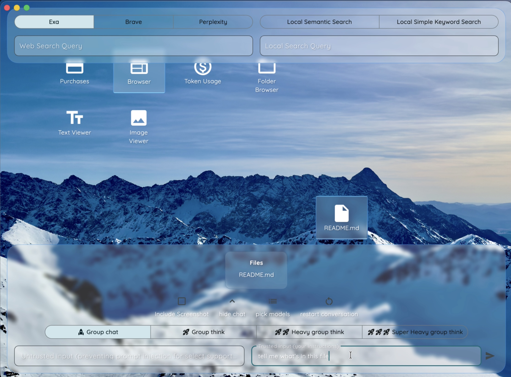

# Note Command

## App preview

## Anti-prompt-injection mechanism

## Web page contents selection added to LLM context

## Drag-dropped file contents added to LLM context

## Group chat

## Group think

## Loading outputs

## Prompt injection attempt (which failed successfully)

## Search results

## Search results with inline preview

## Search results with preview detached as browser window

